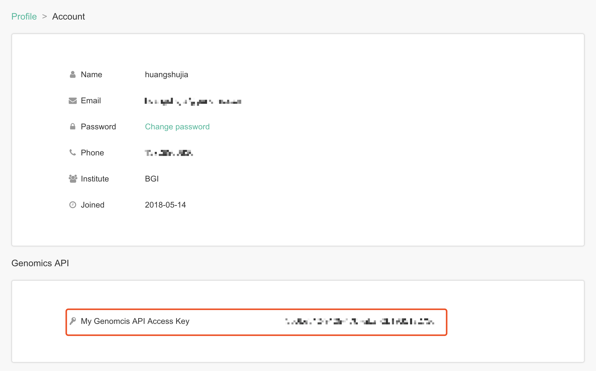

cmdbtools: A command line tools for CMDB varaints browser
=========================================================

[](https://pypi.org/project/cmdbtools/)
[](https://github.com/ShujiaHuang/cmdbtools/blob/master/LICENSE)

Introduction
------------

China is the most populous country and the second largest economy in the
world. However, the construction of Chinese genome database is in slow
progress. At present, among the world\'s large-scale international and
national genome sequencing projects, such as 1KGP, Genomics England,
Genome of the Netherlands, ExAC are mostly biased towards the
construction of a genomic baseline for European populations. In those
projects, while the sample size goes up to hundreds of thousands for
samples with european ancestry in those database, the sequen-cing
Chinese samples is no more than a thousand.

Since a high-quality genomic baseline database serves as an important
control for medical research and population-oriented clinical and drug
applications, the Chinese millionome database (CMDB) is developed to
fill the gap.

The [Chinese Millionome Database(CMDB)](https://db.cngb.org/cmdb/) is a
unique large-scale Chinese genomics database produced by BGI and hosted
in the National GeneBank. The CMDB delivers peridical and useful
variation information and scientific insights derived from the analysis
of millions of Chinese sequencing data. The results aim to promote
genetic research and precision medicine actions in China.

The delivering information includes any of detected variants and the
corresponding allele frequency, annotation, frequency comparison to the
global populations from existing databases, etc.

Benchmarking detail and methods are described in our *Cell* paper:

Liu, S. et al.(2018) Genomic Analyses from Non-invasive Prenatal Testing
Reveal Genetic Associations, Patterns of Viral Infections, and Chinese
Population History. *Cell*, 2, 347-359.
[DOI:https://doi.org/10.1016/j.cell.2018.08.016](https://doi.org/10.1016/j.cell.2018.08.016)

**cmdbtools** is a command line tool for this CMDB variants browser.

Quick start
-----------

CMDB variant browser allows authorized access its data through an
Genomics API and **cmdbtools** is a convenient command line tools for
this purpose.

Installation
------------

Install the released version by `pip` (Only support Python3 since v1.1.0):

```bash
pip install cmdbtools
```

Setup
-----

Please enable your API access from Profile in [CMDB
browser](https://db.cngb.org/cmdb) before using **cmdbtools**.

Login
-----

Login with `cmdbtools` by using CMDB API access key, which could be
found from Profile-\>Genomics API if you have apply for it.

[](assets/figures/cmdb_genomics_api.png)

```bash
cmdbtools login -k your-genomics-api-key
```

If everything goes smoothly, **means you can use CMDB as one of your
varaints database in command line mode**.

Logout
------

Logout `cmdbtools` by simply run the command below:

```bash
cmdbtool logout
```

Query a single variant
----------------------

Variants could be retrieved from CMDB by using `query-varaint`.

Run `cmdbtools query-variant -h` to see all available options. There\'re
two different ways to retrive variants.

One is to use `-c` and `-p` parameters for single variant, the other way
uses `-l` for multiple positions.

Here are examples for quering single varaint by chromosome name and
position.

```bash
cmdbtools query-variant -c chr17 -p 41234470
```

and you will get something looks like below:

```bash
##fileformat=VCFv4.2
##FILTER=<ID=LowQual,Description="Low quality">
##INFO=<ID=CMDB_AN,Number=1,Type=Integer,Description="Number of Alleles in Samples with Coverage from CMDB_hg19_v1.0">
##INFO=<ID=CMDB_AC,Number=A,Type=Integer,Description="Alternate Allele Counts in Samples with Coverage from CMDB_hg19_v1.0">
##INFO=<ID=CMDB_AF,Number=A,Type=Float,Description="Alternate Allele Frequencies from CMDB_hg19_v1.0">
##INFO=<ID=CMDB_FILTER,Number=A,Type=Float,Description="Filter from CMDB_hg19_v1.0">
#CHROM  POS ID  REF ALT QUAL    FILTER  INFO
17  41234470    rs1060915&CD086610&COSM4416375  A   G   74.38   PASS    CMDB_AF=0.361763,CMDB_AC=4625,CMDB_AN=12757
```

Quering multiple varants.
-------------------------

A list of variants could be retrieved from CMDB by using the parameters
of `-l` when apply by `query-varaint`.

```bash
cmdbtools query-variant -l positions.list > result.vcf
```

Format for [positions.list](tests/positions.list), could be a mixture of
`chrom   position` and `chrom    start   end`, even with or without
`chr` in the chromosome ID column:

```
#CHROM  POS
chr22   17662378
chr22   17662408
22  17662442
22  17662444
22  17662699
22  17662729
22  17690496
22  17662353    17663671
22  17669209    17669357
```

`result.vcf` is VCF format and looks like below:

```
##fileformat=VCFv4.2
##FILTER=<ID=LowQual,Description="Low quality">
##INFO=<ID=CMDB_AN,Number=1,Type=Integer,Description="Number of Alleles in Samples with Coverage from CMDB_hg19_v1.0">
##INFO=<ID=CMDB_AC,Number=A,Type=Integer,Description="Alternate Allele Counts in Samples with Coverage from CMDB_hg19_v1.0">
##INFO=<ID=CMDB_AF,Number=A,Type=Float,Description="Alternate Allele Frequencies from CMDB_hg19_v1.0">
##INFO=<ID=CMDB_FILTER,Number=A,Type=Float,Description="Filter from CMDB_hg19_v1.0">
#CHROM  POS ID  REF ALT QUAL    FILTER  INFO
chr22   17662699    rs58754958  A   G   59.86   PASS    CMDB_AF=0.031047,CMDB_AC=441,CMDB_AN=13553
chr22   17662793    rs7289170   A   G   64.23   PASS    CMDB_AF=0.050419,CMDB_AC=842,CMDB_AN=16135
chr22   17669245    rs116020027 G   T   30.3    PASS    CMDB_AF=0.003453,CMDB_AC=43,CMDB_AN=11280
chr22   17690409    rs362129    G   A   32.3    PASS    CMDB_AF=0.065438,CMDB_AC=686,CMDB_AN=10236
```

You can even use `-c` `-p` and `-l` simultaneously if you like.

```bash
cmdbtools query-variant -c 22 -p 46616520 -l positions.list > result.vcf
```

Annotate your VCF files
-----------------------

Annotate your VCF file with CMDB by using `cmdbtools annotate` command.

Download a list of example variants in VCF format from
[multiple_samples.vcf.gz](tests/multiple_samples.vcf.gz). To annotate
this list of variants with allele frequences from CMDB, you can just run
the following command in Linux or Mac OS.

```bash
cmdbtools annotate -i multiple_samples.vcf.gz > multiple_samples_CMDB.vcf
```

It\'ll take about 2 ~ 3 minutes to complete 3,000+ variants\'
annotation. Then you will get 4 new fields with the information of CMDB
in VCF INFO:

-   `CMDB_AF`: Allele frequece in CMDB;
-   `CMDB_AN`: Coverage in CMDB in population level;
-   `CMDB_AC`: Allele count in population level in CMDB;
-   `CMDB_FILTER`: Filter status in CMDB.

```
##fileformat=VCFv4.2
##ALT=<ID=NON_REF,Description="Represents any possible alternative allele at this location">
##FILTER=<ID=LowQual,Description="Low quality">
##INFO=<ID=AC,Number=A,Type=Integer,Description="Allele count in genotypes, for each ALT allele, in the same order as listed">
##INFO=<ID=AF,Number=A,Type=Float,Description="Allele Frequency, for each ALT allele, in the same order as listed">
##INFO=<ID=AN,Number=1,Type=Integer,Description="Total number of alleles in called genotypes">
##INFO=<ID=BaseQRankSum,Number=1,Type=Float,Description="Z-score from Wilcoxon rank sum test of Alt Vs. Ref base qualities">
##reference=file:///home/tools/hg19_reference/ucsc.hg19.fasta
##INFO=<ID=CMDB_AN,Number=1,Type=Integer,Description="Number of Alleles in Samples with Coverage from CMDB_hg19_v1.0">
##INFO=<ID=CMDB_AC,Number=A,Type=Integer,Description="Alternate Allele Counts in Samples with Coverage from CMDB_hg19_v1.0">
##INFO=<ID=CMDB_AF,Number=A,Type=Float,Description="Alternate Allele Frequencies from CMDB_hg19_v1.0">
##INFO=<ID=CMDB_FILTER,Number=A,Type=Float,Description="Filter from CMDB_hg19_v1.0">
#CHROM  POS     ID      REF     ALT     QUAL    FILTER  INFO
chr21   9413612 .       C       T       6906.62 .       AC=25;AF=0.313;AN=80;BaseQRankSum=0.425;CMDB_AC=2459;CMDB_AF=0.207525;CMDB_AN=11834;CMDB_FILTER=PASS
chr21   9413629 .       C       T       8028.88 .       AC=30;AF=0.375;AN=80;BaseQRankSum=-1.200e+00;CMDB_AC=6906;CMDB_AF=0.305445;CMDB_AN=22406;CMDB_FILTER=PASS
chr21   9413700 .       G       A       7723.82 .       AC=30;AF=0.375;AN=80;BaseQRankSum=-9.000e-02
chr21   9413735 .       C       A       10121.72        .       AC=35;AF=0.438;AN=80;BaseQRankSum=0.977;CMDB_AC=2385;CMDB_AF=0.283965;CMDB_AN=8382;CMDB_FILTER=PASS
chr21   9413839 .       C       T       8192.08 .       AC=28;AF=0.350;AN=80;BaseQRankSum=-5.200e-02
chr21   9413840 .       C       A       11514.35        .       AC=38;AF=0.475;AN=80;BaseQRankSum=0.253
chr21   9413870 .       T       C       7390.60 .       AC=26;AF=0.325;AN=80;BaseQRankSum=-4.270e-01
chr21   9413880 .       T       A       146.96  .       AC=1;AF=0.013;AN=80;BaseQRankSum=2.12;ClippingRankSum=0.00
chr21   9413909 .       G       A       1131.78 .       AC=10;AF=0.125;AN=80;BaseQRankSum=0.549;CMDB_AC=209;CMDB_AF=0.01507;CMDB_AN=13683;CMDB_FILTER=PASS
chr21   9413913 .       C       T       8120.65 .       AC=28;AF=0.350;AN=80;BaseQRankSum=-4.390e-01;CMDB_AC=2870;CMDB_AF=0.205597;CMDB_AN=13955;CMDB_FILTER=PASS
chr21   9413945 .       T       C       43787.68        .       AC=71;AF=0.888;AN=80;BaseQRankSum=0.089
chr21   9413995 .       C       T       9632.44 .       AC=29;AF=0.363;AN=80;BaseQRankSum=0.747
chr21   9413996 .       A       G       41996.48        .       AC=71;AF=0.888;AN=80;BaseQRankSum=-1.242e+00;CMDB_AC=3308;CMDB_AF=0.688533;CMDB_AN=4790;CMDB_FILTER=PASS
chr21   9414003 .       T       C       4256.54 .       AC=19;AF=0.238;AN=80;BaseQRankSum=-6.030e-01
```

Citation
--------

**If you use CMDB in your scientific publication, we would appreciate
citation this paper:**

Siyang Liu, Shujia Huang. et al.(2018) Genomic Analyses from
Non-invasive Prenatal Testing Reveal Genetic Associations, Patterns of
Viral Infections, and Chinese Population History. *Cell*, 2, 347-359.
[DOI:https://doi.org/10.1016/j.cell.2018.08.016](https://doi.org/10.1016/j.cell.2018.08.016)
